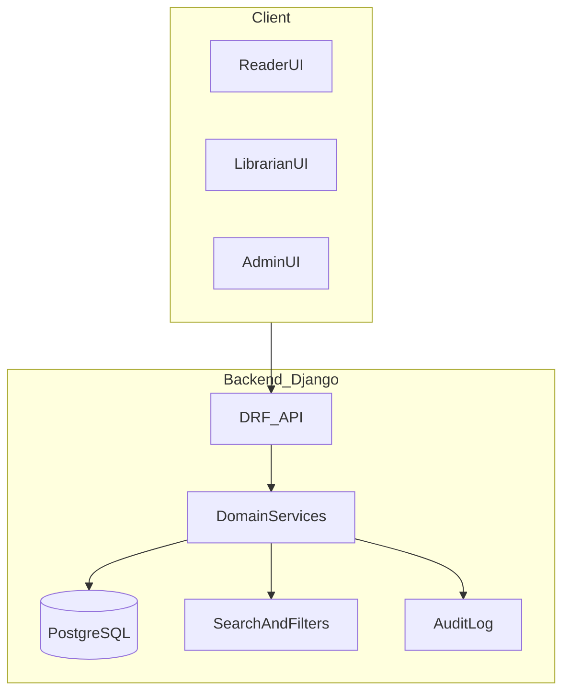
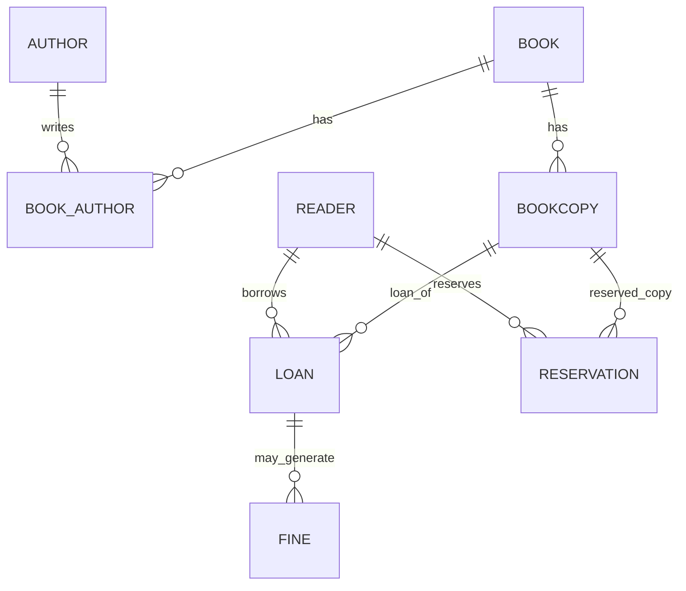

## Цели

- **Цель**: описать полную функциональность системы учета выданных книг в библиотеке, её архитектуру (Django REST Framework + Next.js) и детальную модель данных (БД).
- **Масштаб**: одна небольшая библиотека (до ~10 тыс. книг, несколько сотрудников) с возможностью роста.

## Архитектура приложения

- **Общий подход**:
  - **Backend**: Django + Django REST Framework, REST API, аутентификация по JWT.
  - **Frontend**: Next.js (React, App Router), общение с API через `fetch`.
  - **БД**: PostgreSQL как основная БД, при локальной разработке возможен fallback на `sqlite3`.

- **Слоистая архитектура backend**:
  - `models` — ORM‑модели и связи.
  - `serializers` — преобразование моделей в JSON и обратно.
  - `views` / `viewsets` — REST‑эндпоинты.
  - `urls` — маршрутизация.
  - `services` — прикладная бизнес‑логика (выдача, возврат, просрочки и т.п.).
  - `permissions` — права доступа по ролям.
  - `signals` — аудит и побочные действия (логирование, пересчеты).

- **Роли пользователей**:
  - **Администратор**: управление справочниками, правами, глобальными настройками.
  - **Библиотекарь**: операции выдачи/возврата, продления, бронирования, штрафы, работа с читателями.
  - **Читатель**: личный кабинет, просмотр каталога, статус выданных книг, запрос продления, бронирование.

## Модель данных (БД)

### Основные сущности

- **`Author` (Автор)**
  - `id`
  - `first_name`, `last_name`, `middle_name` (nullable)
  - `date_of_birth`, `date_of_death` (nullable)
  - `description` (краткая биография)

- **`Publisher` (Издательство)**
  - `id`
  - `name`
  - `country` (nullable)
  - `city` (nullable)

- **`Category` / `Genre` (Категория / Жанр)**
  - `id`
  - `name`
  - `parent` (self‑FK для иерархии тематик)

- **`Book` (Книга — библиографическая запись)**
  - `id`
  - `title`
  - `subtitle` (nullable)
  - `authors` (M2M с `Author`)
  - `publisher` (FK `Publisher`)
  - `isbn` (уникальный, nullable для старых изданий)
  - `year`
  - `categories` (M2M `Category`)
  - `language`
  - `description`
  - `cover_image` (URL/файл)

- **`BookCopy` (Экземпляр)**
  - `id`
  - `book` (FK `Book`)
  - `inventory_number` (уникальный учетный номер)
  - `barcode` (nullable, если есть сканер штрих‑кодов)
  - `location` (строка или FK на справочник «зал/стеллаж/полка»)
  - `status` (enum: `available`, `on_loan`, `reserved`, `lost`, `repair`)
  - `acquired_date`
  - `writeoff_date` (nullable)

- **`Reader` (Читатель)**
  - `id`
  - `user` (FK на `auth.User` или кастомную `User`)
  - `card_number` (уникальный номер читательского билета)
  - `phone`, `email`
  - `address`
  - `date_registered`
  - `is_blocked` (например, при крупных штрафах или нарушениях)

- **`Staff` (Сотрудник)**
  - `id`
  - `user` (FK на `auth.User`)
  - `role` (enum: `admin`, `librarian`)

- **`Loan` (Выдача/Ссуда)**
  - `id`
  - `copy` (FK `BookCopy`)
  - `reader` (FK `Reader`)
  - `issued_by` (FK `Staff`)
  - `issue_date`
  - `due_date` (дата, до которой надо вернуть)
  - `return_date` (nullable)
  - `return_processed_by` (FK `Staff`, nullable)
  - `status` (enum: `active`, `returned`, `overdue`, `lost`)

- **`Reservation` (Бронь)**
  - `id`
  - `copy` (FK `BookCopy`) или `book` (бронь на любую копию книги)
  - `reader` (FK `Reader`)
  - `created_at`
  - `expires_at`
  - `status` (enum: `active`, `fulfilled`, `cancelled`, `expired`)

- **`FinePolicy` (Политика штрафов)**
  - `id`
  - `daily_rate` (штраф за день просрочки)
  - `max_fine_per_loan`
  - `grace_period_days` (льготный период без штрафа)

- **`Fine` (Штраф)**
  - `id`
  - `loan` (FK `Loan`)
  - `amount`
  - `calculated_at`
  - `paid_amount`
  - `paid_at` (nullable)
  - `status` (enum: `unpaid`, `partially_paid`, `paid`, `cancelled`)

- **`AuditLog` (Журнал аудита)**
  - `id`
  - `user` (FK `auth.User`, nullable для системных событий)
  - `entity_type` (строка: `Book`, `BookCopy`, `Loan` и т.п.)
  - `entity_id`
  - `action` (enum: `create`, `update`, `delete`, `issue`, `return`, `prolong`, `reserve`, `pay_fine` и др.)
  - `timestamp`
  - `data_before` (JSON)
  - `data_after` (JSON)

- **Ключевые связи и ограничения**:
  - `BookCopy.status` синхронизируется с наличием активных `Loan`/`Reservation`.
  - У `Reader` есть лимит по количеству активных `Loan`.
  - Уникальность: `inventory_number`, `card_number`, `isbn` (если указан).

## Функциональные модули backend (DRF)

### 1. Аутентификация и авторизация

- **Функции**:
  - Регистрация читателя (по e‑mail/телефону, опциональное подтверждение почты).
  - Создание учетных записей `Reader` и `Staff` сотрудниками.
  - Логин/логаут, обновление токена.
  - Ролевое разграничение прав: `admin`, `librarian`, `reader`.

- **Пример API**:
  - `POST /api/auth/register-reader/`
  - `POST /api/auth/login/`
  - `POST /api/auth/logout/`
  - `GET /api/auth/me/`

### 2. Каталог книг и справочники

- **Функции**:
  - CRUD для `Author`, `Publisher`, `Category`, `Book`.
  - Импорт книг из CSV/Excel (целевая возможность, пока не реализована).
  - Поиск с фильтрами: название, автор, жанр, год, ISBN, наличие экземпляров.

- **Пример API**:
  - `GET /api/books/` — список + фильтрация.
  - `GET /api/books/{id}/` — карточка книги.
  - `POST /api/books/`, `PUT/PATCH /api/books/{id}/`, `DELETE /api/books/{id}/`.
  - Аналогичные viewset‑ы для `authors`, `publishers`, `categories`.

### 3. Управление экземплярами (`BookCopy`)

- **Функции**:
  - Регистрация новых экземпляров.
  - Изменение местоположения (зал/стеллаж/полка).
  - Пометка как утерянный, списанный, на ремонте.

- **Пример API**:
  - `GET /api/copies/`, `GET /api/copies/{id}/`.
  - `POST /api/copies/`.
  - `PATCH /api/copies/{id}/status/` (смена статуса).

### 4. Учет читателей (`Reader`)

- **Функции**:
  - Регистрация и редактирование профиля читателя (библиотекарем и самим читателем — частично).
  - Привязка к учетной записи пользователя, восстановление доступа.
  - Блокировка/разблокировка читателя.

- **Пример API**:
  - `GET /api/readers/`, `GET /api/readers/{id}/`.
  - `POST /api/readers/`, `PATCH /api/readers/{id}/`.
  - `POST /api/readers/{id}/block/`, `POST /api/readers/{id}/unblock/`.

### 5. Выдача и возврат книг (`Loan`)

- **Функции**:
  - Выдача экземпляра читателю:
    - Проверка статуса `BookCopy`.
    - Проверка лимита активных выдач у читателя.
    - Проверка блокировки читателя.
    - Расчет `due_date` по правилам.
  - Возврат:
    - Установка `return_date`, пересчет статуса `Loan`.
    - Обновление `BookCopy.status` на `available` или `lost`.
    - Расчет просрочки и создание `Fine` (если нужно).
  - Продление:
    - Проверка отсутствия активной брони другим читателем.
    - Проверка лимита по количеству продлений.
    - Сдвиг `due_date`.

- **Пример API**:
  - `POST /api/loans/issue/` — оформить выдачу.
  - `POST /api/loans/{id}/return/` — оформить возврат.
  - `POST /api/loans/{id}/prolong/` — продление.
  - `GET /api/loans/` — список, с фильтрацией по читателю, экземпляру, статусу, датам.

### 6. Бронирование (`Reservation`)

- **Функции**:
  - Создание брони на книгу/экземпляр.
  - Автоматическое истечение брони по `expires_at`.
  - Уведомления о доступности забронированной книги.
  - Выдача по брони:
    - Связь `Loan` с `Reservation`.
    - Смена статуса брони на `fulfilled`.

- **Пример API**:
  - `POST /api/reservations/` — создать бронь.
  - `POST /api/reservations/{id}/cancel/` — отменить.
  - `GET /api/reservations/` — списки, фильтры.

### 7. Штрафы и платежи (`Fine`, `FinePolicy`)

- **Функции**:
  - Расчет штрафа по `FinePolicy` при просрочке `Loan`.
  - Просмотр задолженности читателя.
  - Регистрация оплаты штрафа (сам учет денег может быть внешним).
  - Частичная оплата и списание (статус `partially_paid`, `cancelled`).

- **Пример API**:
  - `GET /api/fines/` — список штрафов, фильтрация по читателю, статусу.
  - `POST /api/fines/{id}/pay/` — отметить оплату.
  - `GET/POST /api/fine-policies/` — настройка политики (для админа).

### 8. Отчеты и аналитика

- **Функции**:
  - ТОП‑читаемые книги за период.
  - Самые активные читатели.
  - Просрочки по датам.
  - Отчет по фонду: количество экземпляров, утерянные, на руках и т.п.

- **Пример API**:
  - `GET /api/reports/top-books/?from=&to=`
  - `GET /api/reports/overdues/?date=`
  - `GET /api/reports/stock/`

### 9. Аудит и логирование (`AuditLog`)

- **Функции**:
  - Логирование ключевых действий над сущностями (книги, экземпляры, читатели, выдачи, штрафы).
  - Фильтрация по пользователю, типу сущности, временному диапазону.

- **Пример API**:
  - `GET /api/audit/` (доступно только администраторам).

## Функциональные модули frontend (Next.js)

### 1. Общие вещи

- **Основные страницы**:
  - `/login`, `/register` — аутентификация читателя.
  - `/` — главная страница с переходом в каталог.
  - `/catalog` — каталог с поиском.
  - `/book/[id]` — карточка книги.
  - `/reader` — личный кабинет читателя.
  - `/staff/...` — разделы для библиотекарей.
  - `/admin/...` — разделы для администратора.

- **Технический стек**:
  - Next.js App Router.
  - Клиентские API-модули на `fetch`.
  - Tailwind + свои компоненты.

### 2. Интерфейс читателя

- **Функции**:
  - Регистрация и вход.
  - Просмотр каталога, расширенный поиск и фильтры.
  - Просмотр карточки книги с информацией о наличии экземпляров.
  - Создание заявок на бронирование.
  - Просмотр активных и завершенных `Loan`.
  - Просмотр запросов на продление и статус решений.
  - Просмотр своих штрафов.

### 3. Интерфейс библиотекаря

- **Функции**:
  - Быстрый поиск читателя по ФИО/карточке/телефону.
  - Быстрый поиск экземпляра по инвентарному номеру/штрих‑коду.
  - Экран «Выдача»:
    - выбор читателя;
    - сканирование/ввод экземпляра;
    - отображение срока возврата, возможных ограничений.
  - Экран «Возврат»:
    - ввод/сканирование экземпляра;
    - показ просрочки и рассчитанного штрафа;
    - оформление возврата и оплаты.
  - Экран управления бронями:
    - список активных броней;
    - выделение истекающих сегодня/завтра;
    - быстрая выдача по брони.
  - Управление читателями: создание, редактирование, блокировка.

### 4. Интерфейс администратора

- **Функции**:
  - Управление справочниками (авторы, издательства, категории, книги).
  - Импорт/экспорт данных (например, CSV/Excel).
  - Настройка политики штрафов, лимитов по количеству выдач, сроков.
  - Доступ к отчетам и аудит‑логам.

## Нефункциональные требования

- **Безопасность**:
  - Ролевая модель доступа (permissions в DRF).
  - Валидация данных на backend и frontend.
  - Базовая защита от типичных веб‑уязвимостей (XSS, CSRF, brute force и т.д.).

- **Производительность**:
  - Индексы по часто используемым полям: `isbn`, `inventory_number`, `card_number`, внешние ключи.
  - Пагинация в списках (книги, экземпляры, читатели, выдачи, штрафы).
  - Возможное кеширование часто запрашиваемых данных (справочники, отчеты).

- **Надежность**:
  - Транзакции при выдаче, возврате, расчете штрафов.
  - Логирование ошибок и ключевых бизнес‑событий.
  - Резервное копирование БД по расписанию.

